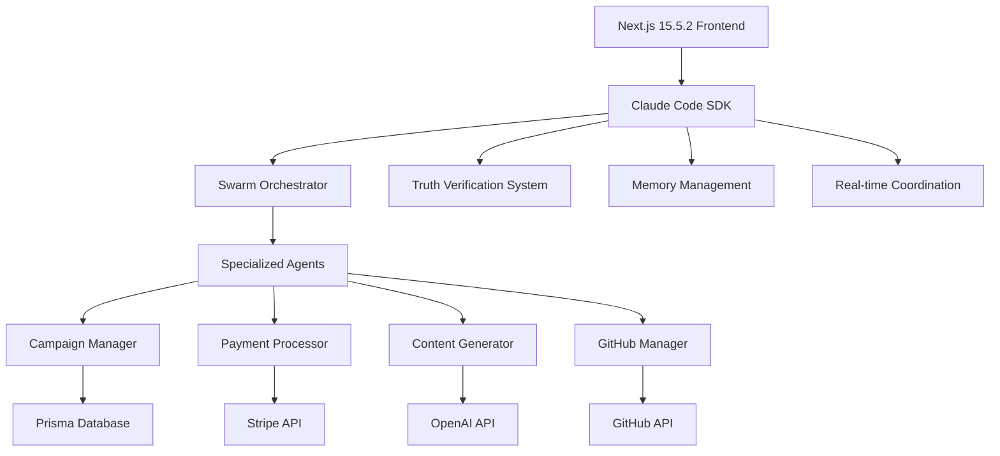

# Claude Code SDK Integration Guide for Vibefunder

## Overview

This guide provides comprehensive documentation for integrating Claude Code's swarm orchestration capabilities with Vibefunder's Next.js 15.5.2 architecture. The integration enables AI-powered campaign management, payment processing coordination, and multi-agent workflow automation.

## Table of Contents

1. [Architecture Overview](#architecture-overview)
2. [Installation and Setup](#installation-and-setup)
3. [Core SDK Features](#core-sdk-features)
4. [Campaign Workflow Integration](#campaign-workflow-integration)
5. [Payment Processing Coordination](#payment-processing-coordination)
6. [Real-time Collaboration](#real-time-collaboration)
7. [Performance Optimization](#performance-optimization)
8. [Testing Strategies](#testing-strategies)
9. [Deployment Considerations](#deployment-considerations)
10. [Best Practices](#best-practices)

## Architecture Overview

### System Integration Pattern



### Key Components

1. **ClaudeCodeSDK**: Main orchestration interface
2. **Agent Definitions**: Specialized AI agents for specific tasks
3. **Workflow Orchestration**: Campaign and payment workflow management
4. **Context Management**: Shared state and collaboration features
5. **Performance Monitoring**: Real-time metrics and optimization

## Installation and Setup

### 1. Install Dependencies

```bash
npm install @claude-code/sdk zod
```

### 2. Environment Configuration

```env
# Claude Code Configuration
CLAUDE_FLOW_API_KEY=your_api_key_here
CLAUDE_FLOW_BASE_URL=https://api.claude-flow.ai
CLAUDE_FLOW_WEBHOOK_URL=https://yourdomain.com/api/claude-flow/webhook

# Verification Settings
CLAUDE_TRUTH_THRESHOLD=0.95
CLAUDE_ENABLE_VERIFICATION=true
CLAUDE_ENABLE_PAIR_PROGRAMMING=false

# Integration Settings
CLAUDE_GITHUB_INTEGRATION=true
CLAUDE_MAX_AGENTS=25
CLAUDE_SWARM_TOPOLOGY=adaptive
```

### 3. Basic SDK Initialization

```typescript
import { ClaudeCodeSDK } from '@/lib/claude-code-sdk';

const sdk = new ClaudeCodeSDK({
  apiKey: process.env.CLAUDE_FLOW_API_KEY,
  baseUrl: process.env.CLAUDE_FLOW_BASE_URL,
  swarmTopology: 'adaptive',
  maxAgents: 25,
  enableVerification: true,
  truthThreshold: 0.95,
  githubIntegration: true,
  webhookUrl: process.env.CLAUDE_FLOW_WEBHOOK_URL
});

// Initialize swarm
const swarmId = await sdk.initializeSwarm();
```

## Core SDK Features

### 1. Swarm Management

```typescript
// Initialize with specific topology
const swarmId = await sdk.initializeSwarm();

// Spawn specialized agents
const agentIds = await sdk.spawnSpecializedAgents();

// Monitor swarm health
const metrics = await sdk.getPerformanceMetrics();

// Optimize performance
await sdk.optimizeSwarmPerformance();
```

### 2. Agent Orchestration

```typescript
// Define custom agent
const agentDefinition = {
  id: 'campaign-optimizer',
  type: 'optimizer',
  name: 'Campaign Optimization Specialist',
  capabilities: ['content optimization', 'engagement analysis'],
  priority: 'high',
  cognitivePattern: 'adaptive'
};

// Spawn agent
const agentId = await sdk.spawnAgent(agentDefinition);
```

### 3. Task Distribution

```typescript
// Distribute task across multiple agents
const task = await sdk.distributeTask(
  'Optimize campaign content for maximum engagement',
  ['optimizer', 'analyst', 'content-generator'],
  'adaptive'
);

// Monitor progress
const status = await sdk.monitorTaskProgress(task.taskId);
```

## Campaign Workflow Integration

### 1. Campaign Creation Orchestration

```typescript
async function createCampaignWithAI(campaignData: CampaignData) {
  // Orchestrate complete campaign creation
  const result = await sdk.orchestrateCampaignCreation(campaignData);

  // Monitor until completion
  let status = await sdk.monitorTaskProgress(result.taskId);
  while (status.status !== 'completed') {
    await new Promise(resolve => setTimeout(resolve, 2000));
    status = await sdk.monitorTaskProgress(result.taskId);
  }

  return status.results;
}
```

### 2. Content Generation Integration

```typescript
// Integrate with TiptapEditor
function useCampaignContentGeneration(campaignId: string) {
  const { sdk } = useClaudeCodeSwarm(config);

  const generateContent = async (contentType: 'description' | 'milestones') => {
    const task = await sdk.distributeTask(
      `Generate ${contentType} for campaign ${campaignId}`,
      ['content-generator', 'analyst'],
      'sequential'
    );

    return task;
  };

  return { generateContent };
}
```

### 3. Campaign Optimization

```typescript
// AI-powered campaign optimization
async function optimizeCampaignPerformance(campaignId: string) {
  const optimization = await sdk.distributeTask(
    `Analyze and optimize campaign ${campaignId} for better conversion`,
    ['optimizer', 'analyst', 'campaign-manager'],
    'adaptive'
  );

  return optimization;
}
```

## Payment Processing Coordination

### 1. Stripe Integration with AI Coordination

```typescript
// Enhanced payment processing with AI oversight
async function processPaymentWithAI(paymentData: PaymentData) {
  const result = await sdk.orchestratePaymentProcessing({
    pledgeId: paymentData.pledgeId,
    amount: paymentData.amount,
    currency: paymentData.currency,
    paymentMethod: paymentData.paymentMethod,
    metadata: {
      campaignId: paymentData.campaignId,
      backerId: paymentData.backerId
    }
  });

  return result;
}
```

### 2. Webhook Processing with AI

```typescript
// API route: /api/claude-flow/webhook
export async function POST(request: Request) {
  const webhookData = await request.json();

  // Process with AI coordination
  const task = await sdk.distributeTask(
    `Process Stripe webhook: ${webhookData.type}`,
    ['stripe-payment-processor', 'campaign-manager'],
    'sequential'
  );

  return NextResponse.json({ taskId: task.taskId });
}
```

### 3. Payment Validation and Security

```typescript
// AI-enhanced payment validation
async function validatePaymentWithAI(paymentMethodId: string) {
  const validation = await sdk.distributeTask(
    `Validate payment method security: ${paymentMethodId}`,
    ['stripe-payment-processor'],
    'sequential'
  );

  return validation;
}
```

## Real-time Collaboration

### 1. Session Management

```typescript
// Initialize collaboration session
const sessionId = 'campaign-edit-session-123';
await sdk.initializeCollaborationContext(sessionId, ['user1', 'user2']);

// Share campaign state
await sdk.shareContext(sessionId, 'campaign-data', campaignData);

// Retrieve shared context
const sharedData = await sdk.retrieveContext(sessionId, 'campaign-data');
```

### 2. React Hook Integration

```typescript
function CampaignEditor({ campaignId }: { campaignId: string }) {
  const { shareData, retrieveData } = useCollaborationContext(sdk, campaignId);

  const handleContentChange = async (content: string) => {
    // Share changes with collaborators
    await shareData('editor-content', content);
  };

  return (
    <TiptapEditor
      content={content}
      onChange={handleContentChange}
    />
  );
}
```

## Performance Optimization

### 1. Swarm Performance Monitoring

```typescript
// Real-time performance monitoring
function usePerformanceOptimization() {
  const { metrics, optimizePerformance } = usePerformanceMonitoring(sdk);

  // Auto-optimize when performance drops
  useEffect(() => {
    if (metrics?.swarmHealth < 0.8) {
      optimizePerformance();
    }
  }, [metrics]);

  return metrics;
}
```

### 2. Intelligent Load Balancing

```typescript
// Optimize task distribution based on agent performance
async function intelligentTaskDistribution(tasks: string[]) {
  const metrics = await sdk.getPerformanceMetrics();

  // Select best-performing agents
  const optimalAgents = Object.entries(metrics.agentPerformance.byType)
    .filter(([_, performance]) => performance > 0.9)
    .map(([type, _]) => type);

  return Promise.all(
    tasks.map(task => sdk.distributeTask(task, optimalAgents, 'adaptive'))
  );
}
```

### 3. Memory Management

```typescript
// Efficient context management
async function optimizeMemoryUsage(sessionId: string) {
  // Compress old session data
  await sdk.executeClaudeFlow('memory_compress', {
    namespace: `collab:${sessionId}`
  });

  // Create backup before cleanup
  await sdk.executeClaudeFlow('memory_backup', {
    path: `/backups/session-${sessionId}`
  });
}
```

## Testing Strategies

### 1. Unit Testing with Mocks

```typescript
import { MockClaudeCodeSDK, createCampaignOrchestrationTests } from '@/utils/claude-code-testing';

describe('Campaign Orchestration', () => {
  let mockSDK: MockClaudeCodeSDK;

  beforeEach(() => {
    mockSDK = new MockClaudeCodeSDK({
      swarmTopology: 'adaptive',
      maxAgents: 10
    });
  });

  test('should orchestrate campaign creation', async () => {
    await mockSDK.initializeSwarm();

    const result = await mockSDK.orchestrateCampaignCreation({
      id: 'test-campaign',
      title: 'Test Campaign'
    });

    expect(result).toHaveValidSwarmResult();
    expect(result).toHaveHighVerificationScore();
  });
});
```

### 2. Integration Testing

```typescript
// Test real API integration
describe('Payment Processing Integration', () => {
  test('should process payment with Stripe coordination', async () => {
    const sdk = new ClaudeCodeSDK(testConfig);
    await sdk.initializeSwarm();

    const paymentResult = await sdk.orchestratePaymentProcessing({
      pledgeId: 'test-pledge',
      amount: 5000,
      currency: 'usd'
    });

    expect(paymentResult).toHaveCompletedSuccessfully();
  });
});
```

### 3. End-to-End Testing

```typescript
// Playwright E2E tests
test('Campaign creation workflow with AI assistance', async ({ page }) => {
  await page.goto('/campaigns/create');

  // Wait for swarm initialization
  await page.waitForSelector('[data-testid="swarm-initialized"]');

  // Fill campaign form
  await page.fill('[name="title"]', 'AI-Powered Test Campaign');

  // Trigger AI content generation
  await page.click('[data-testid="generate-content"]');

  // Verify AI-generated content
  await expect(page.locator('[data-testid="generated-description"]')).toBeVisible();
});
```

## Deployment Considerations

### 1. Environment Configuration

```yaml
# docker-compose.yml
version: '3.8'
services:
  vibefunder:
    build: .
    environment:
      - CLAUDE_FLOW_API_KEY=${CLAUDE_FLOW_API_KEY}
      - CLAUDE_TRUTH_THRESHOLD=0.95
      - CLAUDE_MAX_AGENTS=25
    depends_on:
      - postgres
      - redis
```

### 2. Kubernetes Deployment

```yaml
# k8s-deployment.yml
apiVersion: apps/v1
kind: Deployment
metadata:
  name: vibefunder-claude
spec:
  replicas: 3
  template:
    spec:
      containers:
      - name: vibefunder
        image: vibefunder:latest
        env:
        - name: CLAUDE_FLOW_API_KEY
          valueFrom:
            secretKeyRef:
              name: claude-secrets
              key: api-key
```

### 3. Monitoring and Observability

```typescript
// Add telemetry for production monitoring
sdk.on('task:completed', (event) => {
  // Send metrics to monitoring service
  analytics.track('claude_task_completed', {
    taskId: event.taskId,
    executionTime: event.metadata.executionTime,
    verificationScore: event.metadata.verificationScore
  });
});
```

## Best Practices

### 1. Error Handling

```typescript
// Robust error handling with automatic retry
async function robustTaskExecution(task: string, agents: string[]) {
  const maxRetries = 3;
  let attempt = 0;

  while (attempt < maxRetries) {
    try {
      const result = await sdk.distributeTask(task, agents, 'adaptive');
      return result;
    } catch (error) {
      attempt++;

      if (attempt === maxRetries) {
        // Fallback to degraded functionality
        return await fallbackTaskExecution(task);
      }

      // Exponential backoff
      await new Promise(resolve =>
        setTimeout(resolve, Math.pow(2, attempt) * 1000)
      );
    }
  }
}
```

### 2. Security Considerations

```typescript
// Secure agent communication
const secureSDK = new ClaudeCodeSDK({
  ...config,
  enableVerification: true,
  truthThreshold: 0.95,
  // Enable Byzantine fault tolerance
  byzantineFaultTolerance: true,
  // Encrypt inter-agent communication
  encryptCommunication: true
});
```

### 3. Performance Optimization

```typescript
// Optimize for Vibefunder's specific use cases
const optimizedConfig = {
  swarmTopology: 'adaptive',
  maxAgents: 25,
  enableVerification: true,
  truthThreshold: 0.95,

  // Vibefunder-specific optimizations
  specializationMatrix: {
    'campaign-creation': ['content-generator', 'analyst', 'optimizer'],
    'payment-processing': ['stripe-payment-processor', 'campaign-manager'],
    'github-integration': ['github-manager', 'content-generator']
  },

  // Cache frequently used agent configurations
  enableAgentCaching: true,
  cacheTimeout: 3600000, // 1 hour

  // Optimize for campaign workflow patterns
  workflowOptimization: {
    campaignCreation: {
      parallelContentGeneration: true,
      preloadOptimizationAgents: true
    }
  }
};
```

### 4. Monitoring and Alerting

```typescript
// Production monitoring setup
function setupProductionMonitoring(sdk: ClaudeCodeSDK) {
  // Health check endpoint
  app.get('/health/claude-code', async (req, res) => {
    try {
      const metrics = await sdk.getPerformanceMetrics();
      const isHealthy = metrics.swarmHealth > 0.8;

      res.status(isHealthy ? 200 : 503).json({
        status: isHealthy ? 'healthy' : 'degraded',
        metrics
      });
    } catch (error) {
      res.status(503).json({ status: 'error', error: error.message });
    }
  });

  // Alert on low performance
  sdk.on('performance:degraded', (event) => {
    alerting.send({
      severity: 'warning',
      message: `Claude Code performance degraded: ${event.metric}`,
      value: event.value,
      threshold: event.threshold
    });
  });
}
```

## Conclusion

This integration guide provides a comprehensive foundation for implementing Claude Code's swarm orchestration within Vibefunder's ecosystem. The patterns and examples demonstrate how to leverage AI-powered multi-agent coordination for campaign management, payment processing, and real-time collaboration while maintaining high performance and reliability standards.

For additional support or advanced configuration options, refer to the Claude Code documentation or contact the integration support team.